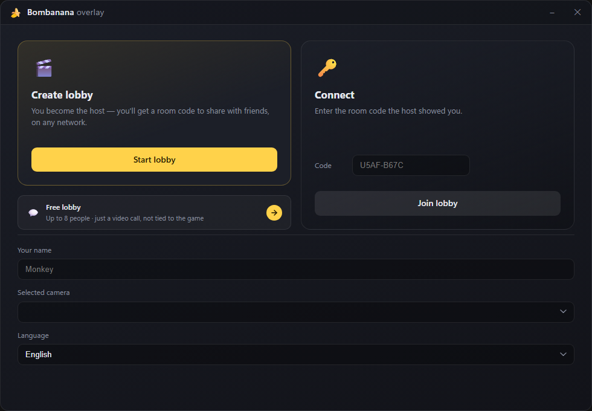
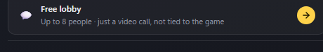
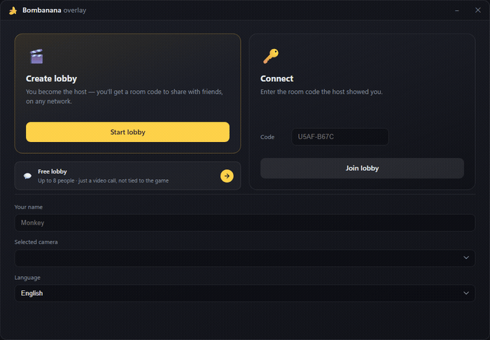

<div align="center">


# Bombanana Overlay

A lightweight always-on-top webcam overlay for playing **BOMBANANA** with friends —
plus a built-in free-form video call room for everyone else. Windows only.



</div>

## What it does

Bombanana Overlay puts a small, click-through webcam strip on top of the game so
you and up to two friends can see each other while you play — no Discord call,
no second monitor, no alt-tabbing. One person hosts, shares a short room code,
and everyone connects directly to each other over WebRTC.

It also doubles as a **Free lobby**: a plain group video call for up to 8 people,
completely decoupled from the game — handy for just hanging out on camera.

- 🎥 **Direct peer-to-peer video**, no server relaying camera streams — signaling
  goes through a lightweight star topology (host relays only small JSON messages),
  video is a full WebRTC mesh between every participant
- 🔁 **Auto-reconnect** — zombie connections get caught by a heartbeat, guests
  quietly rejoin under the same identity after a network hiccup, the host gives
  a grace period before treating anyone as gone
- 🎮 **Live game sync** — watches BOMBANANA's own log file to detect when a
  round starts/ends and which role each player got, no manual clicking required
- 🙈 **Role-based camera visibility** — who can see whose camera (and with
  which visual filter) follows the game's own role rules automatically
- 🌐 **7 languages** — auto-detected from your system, switchable anytime
- ⬆️ **Auto-updates** — checks for new versions on startup and installs them
  in one click
- 🖱️ **Click-through overlay** — the game keeps mouse focus by default, just
  like a Discord overlay

## Free lobby vs. a BOMBANANA lobby

<div align="center">



</div>

| | Regular lobby | Free lobby |
|---|---|---|
| Players | up to 3 | up to 8 |
| Tied to the game | yes — roles, rounds, filters | no — plain video call |
| Use it for | playing BOMBANANA together | just talking on camera |

Both run on the exact same overlay and connection code — free lobby simply
skips everything game-specific.

## Roles

BOMBANANA assigns each of the three players a role for the round, and the
overlay mirrors that role's camera rules automatically — nobody has to toggle
anything by hand:

| Role | Sees other cameras | Camera visible to others | Gets signals |
|---|---|---|---|
| 🙈 Blind | only the Deaf player, in outline vision | yes | yes |
| 🙊 Mute | everyone | no | yes |
| 🙉 Deaf | nobody (just themself) | yes, to both | no |

The "outline vision" the Blind role gets is a real-time edge-detection filter
(SVG `feConvolveMatrix`) applied live to the video feed — not just a plain
grayscale filter. Camera streams that nobody is allowed to see are muted at
the source, not just hidden in the UI. The whole ruleset lives in
[`src/roles.ts`](src/roles.ts) — change the table, change the mechanic.

## Languages



English, Russian, Spanish, French, German, Chinese and Japanese, picked
automatically from your OS locale on first launch. Your choice — along with
your display name and selected camera — is remembered for next time.

## Hotkeys

| Keys | What it does |
|---|---|
| `Ctrl+Shift+O` | toggle click-through — grab the mouse from the game, or give it back |
| `Ctrl+Shift+H` | show/hide the overlay entirely |

## Getting started

```bash
npm install
npm start
```

Build a Windows installer (NSIS, installs to the user profile, no admin needed):

```bash
npm run release
```

The signed `.exe` lands in `src-tauri/target/release/bundle/nsis/`.

Run the Rust-side tests (game log parsing, connection protocol):

```bash
cd src-tauri && cargo test --lib
```

## Good to know before you play

- **Firewall.** Windows will ask about network access the first time someone
  hosts — allow it for private networks or guests won't be able to connect.
- **Borderless window.** The overlay is a normal always-on-top window; it
  can't draw over an exclusive fullscreen game, only borderless/windowed.
- **Works over the internet out of the box.** Connections try direct P2P
  first and fall back to a TURN relay automatically when a strict NAT/firewall
  is in the way — no port forwarding needed.
- **Camera.** If you have more than one, pick which one to use right on the
  home screen before hosting or joining.

## Architecture

```
src/
  main.ts             bootstrap, room/round state machine, wiring
  i18n.ts              translations + locale detection/switching
  settings.ts          persisted name/locale/camera (localStorage)
  roles.ts              role visibility rules
  state.ts, types.ts    app state store and shared types
  config.ts             overlay sizing/layout constants
  media/camera.ts       local camera capture
  game/gameWatcher.ts    listens for round/lobby events from Rust
  network/
    signal.ts           room signaling — star topology through the host
    videoMesh.ts         WebRTC full mesh (direct video between every peer)
    peerBroker.ts         PeerJS connection lifecycle + auto-reconnect
    heartbeat.ts          detects dead connections the browser doesn't close
    identity.ts, roomCode.ts, iceConfig.ts, protocol.ts
  ui/
    dom.ts               markup + DOM refs
    render.ts             state → DOM rendering
src-tauri/src/
  lib.rs                window/overlay commands, hotkeys, power-throttling fix
  commands/game_log.rs   watches BOMBANANA's log for round/role/lobby events
  commands/window.rs     click-through + overlay window commands
```

The host holds the authoritative room state (who's in, whose turn, what
role); everyone else applies the snapshots it broadcasts. Signaling rides on
a free public PeerJS broker — no server to run or maintain — while actual
video never touches it.

## Current limitations

- Rounds need exactly 3 players in a regular lobby; a 4th stays without a
  role. Two players can still start, useful for testing the connection.
- No round timer or score tracking.
- Free lobby caps out at 8 — the 9th person to try gets turned away with a
  message explaining why.
